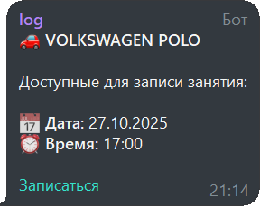

# automiet-slot-monitor

Сервис для мониторинга свободных мест для записи на вождение в автошколе "МИнуЭТ" (edu.automiet.ru).

**Статус: Архивный.**
Проект был разработан для личного использования в период обучения (2024-2025 гг.) и в настоящее время не поддерживается. Код выложен в качестве демонстрации навыков.

## Обзор

Сервис с заданным интервалом опрашивает API автошколы для проверки доступных слотов для записи по заданным инструкторам и автомобилям. При появлении нового слота сервис отправляет уведомление в указанный чат Telegram.

### Пример работы


Ключевые функции:
- Автоматическое управление JWT-токеном.
- Фильтрация слотов по инструктору, автомобилю и диапазону дат.
- Отправка уведомлений через Telegram Bot API (с поддержкой топиков).
- Конфигурация через переменные окружения с валидацией `pydantic-settings`.
- Управление зависимостями через `uv`.

## Структура проекта

Проект организован в виде стандартного Python-пакета:

```text
.
├── minuet_bot/
│   ├── __init__.py
│   ├── main.py            # Точка входа
│   ├── config.py          # Конфигурация Pydantic
│   ├── api_client.py      # Клиент API автошколы
│   └── notifier.py        # Сервис уведомлений
├── .env.example           # Шаблон переменных окружения
├── pyproject.toml         # Конфигурация проекта и зависимостей
├── uv.lock                # Лок-файл зависимостей
├── LICENSE
└── README.md
````

## Установка

Для управления проектом используется [uv](https://github.com/astral-sh/uv).

1.  **Клонируйте репозиторий:**

    ```bash
    git clone https://github.com/tslyf/minuet-bot.git
    cd minuet-bot
    ```

2.  **Установите зависимости:**
    Команда создаст виртуальное окружение и синхронизирует версии пакетов из лок-файла.

    ```bash
    uv sync --locked
    ```

3.  **Настройте конфигурацию:**

      * Создайте файл `.env` в корне проекта (на основе `.env.example`).
      * Заполните обязательные переменные окружения.

### Переменные окружения

**Обязательные:**

| Переменная | Описание |
|---|---|
| `EMAIL` | Логин (email) от личного кабинета edu.automiet.ru |
| `PASSWORD` | Пароль от личного кабинета |
| `TELEGRAM_BOT_TOKEN` | Токен вашего Telegram-бота |
| `TELEGRAM_CHAT_ID` | ID чата/канала для отправки уведомлений |

*Примечание: Цели мониторинга (инструкторы, машины, даты) задаются в файле `minuet_bot/config.py`.*

## Запуск

Запуск сервиса осуществляется через `uv run`:

```bash
uv run -m minuet_bot.main
```

## Лицензия

MIT
